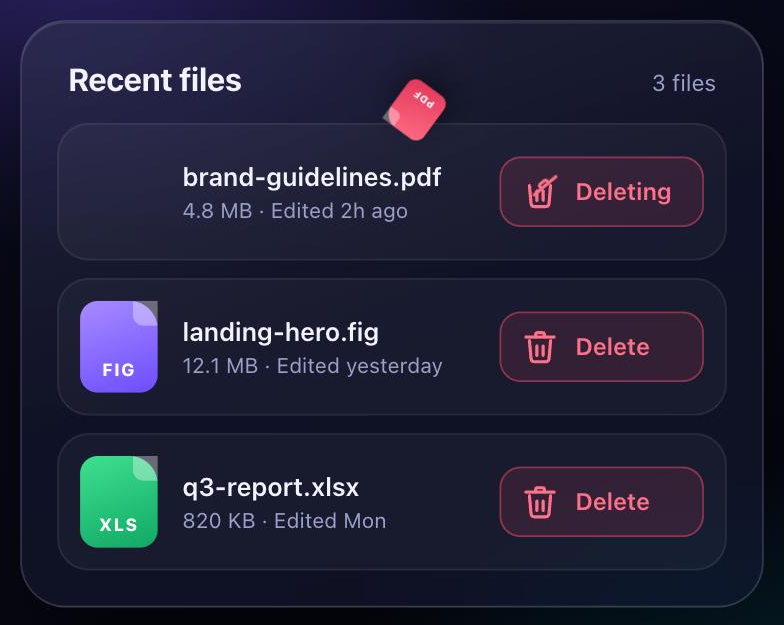

# Delete File Button

A delete button whose trash can swings its lid open, catches the file as it tumbles in and slams shut with a bounce, while the row slides away and an undo toast appears.



**[Live demo](https://arslanagayev.github.io/delete-file-animation/)** · **[Reel mode](https://arslanagayev.github.io/delete-file-animation/?reel)** · UI animation #02 of a weekly series on Instagram [@arslanagayev.dev](https://www.instagram.com/arslanagayev.dev/)

Plain **HTML, CSS and JavaScript**: no frameworks, no build step, no dependencies. Click **Delete** on any file, then **Undo** in the toast.

## How it works

1. The bin's lid swings open on its hinge.
2. The file's badge leaves its row and **tumbles along an arc** into the bin.
3. A sheet drops past the rim, then the lid **slams shut with an overshoot bounce** and the bin wobbles.
4. The button turns green, the row slides out and collapses, and a toast offers **Undo**.

## Features

- Every step is a Web Animations API call you can `await`, so the sequence reads top to bottom
- Pure SVG trash icon: the lid, sheet and body are animated separately
- Undo restores the row with its own entrance animation
- Real `<button>` elements with labels, `aria-live` toast, `prefers-reduced-motion` support

## The key code

```js
// The lid swings open on its hinge...
lid.animate(
  [{ transform: 'none' },
   { transform: 'translate(1px, -3px) rotate(-40deg)' }],
  { duration: 260, fill: 'forwards' },
);
await flyIntoBin(row, can); // the file arcs into the bin

// ...then slams shut with an overshoot bounce
lid.animate(
  [{ transform: 'rotate(-40deg)' }, { transform: 'none' }],
  { duration: 380, easing: 'cubic-bezier(.34, 1.8, .64, 1)' },
);
```

## Use it in your project

Copy `index.html`, `style.css` and `script.js`. The component itself has no dependencies; the `reel/` folder is only used by the reel mode described below. To drop it, delete the `mountReel(...)` call at the end of `script.js` and its import on the first line.

## Reel mode

Add `?reel` to the URL and the page becomes a self-playing 1080×1920 video stage: a title, the animation driven by a scripted cursor, a code excerpt and an end card, on a loop. Open it on a phone and use the built-in screen recorder to get an Instagram reel. `?autoplay` loops the scripted demo without the frame.

## Run locally

ES modules don't load from `file://`, so serve the folder:

```bash
git clone https://github.com/arslanagayev/delete-file-animation.git
cd delete-file-animation
python3 -m http.server 8080   # then open http://localhost:8080
```

## License

[MIT](LICENSE) © 2026 Arslan Agayev
